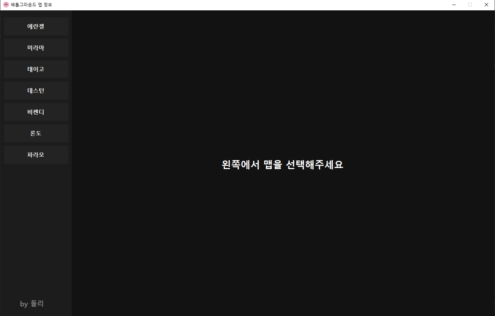
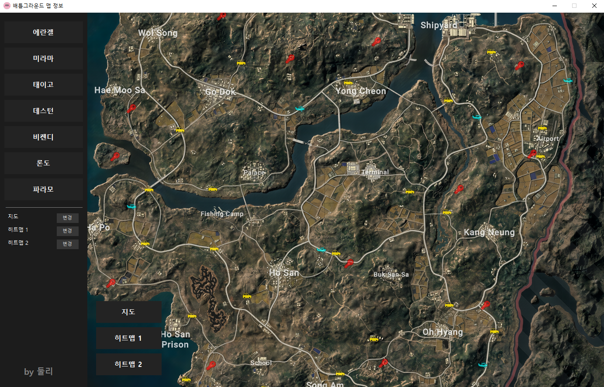
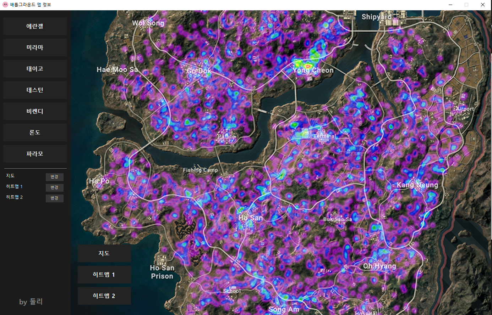

## 배틀그라운드 간편하게 지도 보기

주로 경쟁전할 때 지도 폴더에서 에란겔 걸리면 에란겔 열어서 보다가 미라마 걸리면 미라마 열어서 보다가 하는게 귀찮아서..
만들게 된 계기인데 경쟁전할 땐 편하게 쓰는 편.. 다른 사람들은 편할랑가..
맵 변경 후 원복하는거 아직 안만듬.. 나중에..  

<a href="https://tlanfk.github.io/" target="_blank">나만 보는 키 설정</a>
